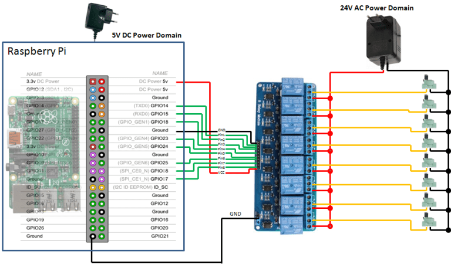

# POR
Pi Open Retic - A web based way to control your sprinklers or reticulation.

This project I started as a way to learn Python and Django using a PI Raspberry so some of the coding will not be up to scratch. By connecting to the GPIO you can add run cycles and stations and there is a "ReticEngine" run by cron which will pick up when to water. It even checks the local BOM stations to see if has been raining and will turn off once a configurable threshold is reached.

This project is built on a Bootstrap 3 Django implementation. It also uses the excellent django-tables import for most of the data formatting. When setting up, there might be a bit of meta data I've forgotten to include (although the Models should create the base tables at least. Please let me know if there are issues.

If you would like to contribute, please get in touch!

# Major Features
* Responsive Web based control (including mobile Android iOS)  
* Shows current weather information
* Manual Control  
* Scheduled Control  
* System test ability
* Named Zones
* Supports master valve/pump output
* Very simple installation provided prerequisities are met

# What you will need
1. Raspberry PI - I have used a Zero W for mine.
2. Python 3.6+, Django 2+, Mysql/MariaDB - or SQLite (not tested).
3. 5V Relay switches - 1 for each sprinkler and an optional "master" with sandwich board wires.
4. 24v AC power supply if you do not already have one (your old system should already have this)
5. Some knowledge of Django - especially how to "runserver" and "makemigrations/migrate" using manage.py

# Setup instructions
1. Clone the repo
2. Have a look at the settings.py and make sure the following are installed at least (you might need more or less - check errors):  
   &nbsp;   &nbsp;   &nbsp;   &nbsp;   &nbsp;  a) pip install RPI.GPIO  
   &nbsp;   &nbsp;   &nbsp;   &nbsp;   &nbsp;  b) pip install gpiozero  
   &nbsp;   &nbsp;   &nbsp;   &nbsp;   &nbsp;  c) pip install python-dateutil  
   &nbsp;   &nbsp;   &nbsp;   &nbsp;   &nbsp;  d) apt-get install python-mysqldb (for mysqlclient)  
   &nbsp;   &nbsp;   &nbsp;   &nbsp;   &nbsp;  e) pip install django_tables2  
   &nbsp;   &nbsp;   &nbsp;   &nbsp;   &nbsp;  f) pip install widget_tweaks  
   &nbsp;   &nbsp;   &nbsp;   &nbsp;   &nbsp;  g) pip install axes  
   &nbsp;   &nbsp;   &nbsp;   &nbsp;   &nbsp;  h) pip install django_filters  

3. Create a user por/por on your local database (you can change this in settings.py)
4. Use Django to migrate the database (create the tables) 
5. A "cron" job to run "retic_engine.py" at 1 minute intervals.

# TODO
1. A screen for the addition of weather stations - it's rather hard coded at the moment.
2. A screen to Add Stations - this is done manually but you can configure the GPIO assigments later.
3. Some performance improvements.
4. Remove redundant code - there is code for sign in, REST calls etc., which might not be needed.
4. Lots of other little things.

# Working Screen

# Relay Schematic

